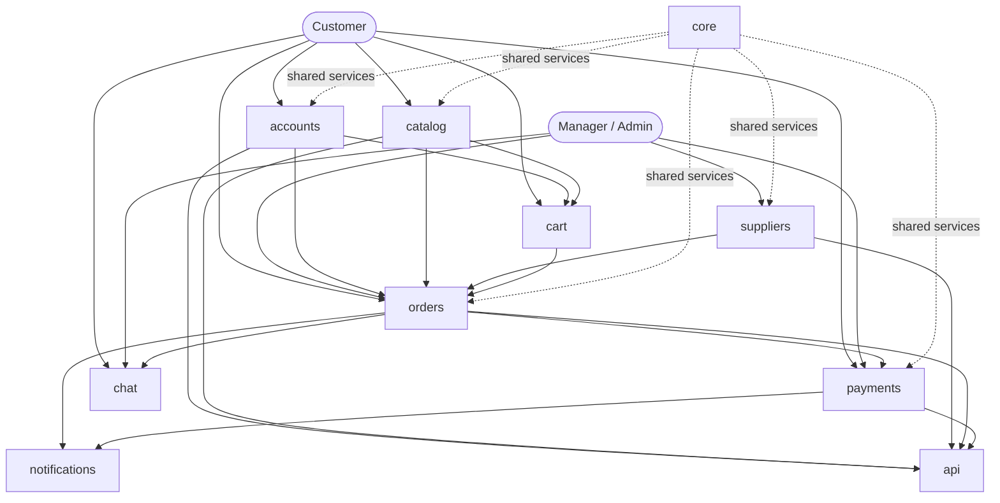
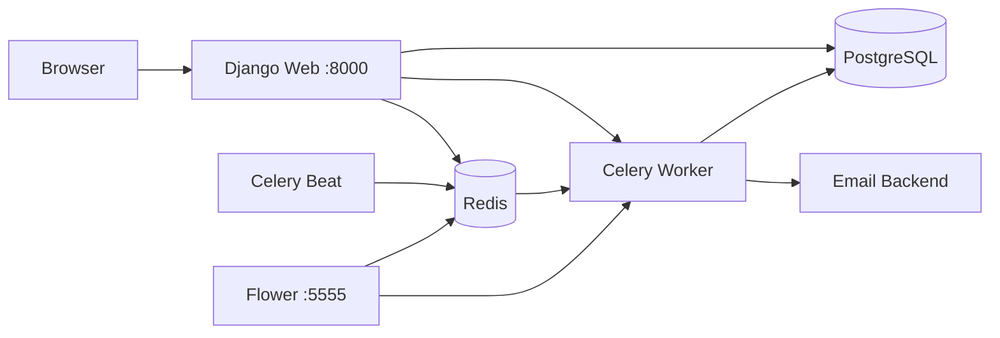

<div align="center">

# ⚡ Shop_ePower

### Modern B2B/B2C e-commerce platform for electrical products

A modular Django platform that covers the complete order lifecycle:  
**catalog → cart → checkout → stock reservation → manager workflow → payment → invoice → notifications → history**

<br>


[](https://github.com/asmpc/Shop_ePower/actions/workflows/ci.yml)


</div>

---

## 🚀 Project Overview

**Shop_ePower** is a full-stack e-commerce platform developed as a diploma project and designed around realistic business processes for selling electrical equipment.

The project goes far beyond a basic CRUD store. It combines customer accounts, product catalog management, supplier inventory, stock reservation, order processing, payment workflows, PDF invoices, email notifications, internal customer support, REST API endpoints, and containerized asynchronous infrastructure.

The codebase follows modern Django engineering practices:

- modular domain-oriented applications;
- service-layer business logic;
- selector-based query logic;
- Test-Driven Development;
- asynchronous tasks with Celery;
- reproducible Docker Compose infrastructure;
- extensive frontend, service, and API test coverage.

---

## 🔥 Business Workflow

```text
                              CUSTOMER
                                  │
                                  ▼
                         PRODUCT CATALOG
                                  │
                                  ▼
                          SHOPPING CART
                                  │
                                  ▼
                              CHECKOUT
                                  │
                                  ▼
                          ORDER CREATION
                                  │
              ┌───────────────────┼───────────────────┐
              ▼                   ▼                   ▼
      STOCK RESERVATION     MANAGER WORKFLOW     CUSTOMER CHAT
              │                   │
              ▼                   ▼
       SUPPLIER STOCK       PAYMENT PROCESSING
                                  │
                         ┌────────┴────────┐
                         ▼                 ▼
                    INVOICE PDF       NOTIFICATIONS
                         │                 │
                         └────────┬────────┘
                                  ▼
                           ORDER HISTORY
```

This workflow reflects the central idea of Shop_ePower: independent business domains cooperate through clear responsibilities instead of being tightly coupled into a single application.

---

## ✨ Key Features

<table>
<tr>
<td width="50%" valign="top">

### 🛍️ Product Catalog

- Categories and brands
- Product image gallery
- Product variants
- Search, filtering and sorting
- Pagination with preserved filters
- Dynamic pricing
- BYN, RUB and USD display
- Public inventory information
- Own-stock and supplier-stock separation
- Supplier lead-time display

</td>
<td width="50%" valign="top">

### 👤 Customer Accounts

- Email-based authentication
- Customer, manager and administrator roles
- Customer profile management
- Individual customer support
- Legal entity profile support
- Profile completeness validation
- Secure redirect back to the original workflow
- JWT authentication for REST API

</td>
</tr>

<tr>
<td width="50%" valign="top">

### 🛒 Shopping & Checkout

- Persistent shopping cart
- Cart merge after authentication
- Price snapshots
- Checkout validation
- Pickup and shipping workflows
- Delivery provider and address
- Customer and delivery comments
- Guest checkout onboarding flow
- Temporary online-payment restriction

</td>
<td width="50%" valign="top">

### 📦 Order Management

- Complete order lifecycle
- Customer data snapshots
- Legal entity snapshots
- Automatic stock reservation
- Oversell protection
- Manager order processing
- Delivery updates
- Controlled cancellation workflow
- Reservation rollback after cancellation
- Customer and manager order views

</td>
</tr>

<tr>
<td width="50%" valign="top">

### 💳 Payments & Invoices

- Payment creation for orders
- Payment methods: invoice, on receipt, online
- Pending, paid, failed and cancelled statuses
- Immutable payment history
- Manager payment actions
- Administrator-only reset actions
- Invoice generation
- PDF generation with ReportLab
- Client and manager invoice access
- Controlled invoice cancellation

</td>
<td width="50%" valign="top">

### 💬 Communication

- Order-created email notifications
- Asynchronous Celery delivery
- Automatic retry and backoff
- Customer–manager chat rooms
- Free-room manager workflow
- Manager assignment
- File attachments
- Unread counters
- Customer room closing

</td>
</tr>

<tr>
<td width="50%" valign="top">

### 🏢 Suppliers & Inventory

- Internal warehouse support
- External supplier support
- Supplier products
- Supplier prices and currencies
- Active/inactive inventory records
- Public inventory aggregation
- Detailed manager inventory
- Minimum lead-time calculation
- Multi-source stock reservation

</td>
<td width="50%" valign="top">

### 🔌 REST API

- Django REST Framework
- JWT login, refresh and logout
- Swagger / OpenAPI documentation
- Catalog endpoints
- Supplier endpoints
- Client order endpoints
- Manager order endpoints
- Client payment endpoints
- Manager payment actions
- Payment history endpoints
- Invoice and PDF endpoints

</td>
</tr>
</table>

---

## 🏗️ Architecture

Shop_ePower uses modular Django applications. Each application owns a specific business responsibility, while services and selectors keep business rules separate from presentation and transport layers.

### Application Responsibilities

| Application | Responsibility |
|---|---|
| `accounts` | Users, roles, authentication, customer profiles and legal entities |
| `catalog` | Products, categories, brands, images, variants and public catalog |
| `suppliers` | Suppliers, supplier products, warehouse and external inventory |
| `cart` | Shopping cart, cart items and price snapshots |
| `orders` | Checkout, orders, order items, stock reservation and delivery |
| `payments` | Payments, statuses, history, invoices and PDF generation |
| `notifications` | Email services and asynchronous notification tasks |
| `chat` | Rooms, messages, attachments, assignment and unread state |
| `api` | REST API endpoints, serializers and permissions |
| `core` | Shared currency, pricing, settings, utilities and infrastructure |

### Application Architecture



### Infrastructure Architecture



### Design Principles

- Clear separation of business domains
- Thin views and API views
- Service-layer commands for business operations
- Selectors for optimized read operations
- Snapshot data for historical integrity
- Explicit permissions for client, manager and administrator roles
- Celery tasks as thin orchestration functions
- Primitive identifiers passed through task queues
- `transaction.on_commit()` for post-transaction tasks
- Regression tests for every discovered production-like issue
- Technical debt documented instead of hidden

---

## ⚙️ Technology Stack

| Layer | Technologies |
|---|---|
| Language | Python 3.14 |
| Web Framework | Django 6 |
| REST API | Django REST Framework, Simple JWT |
| API Documentation | drf-spectacular, Swagger / OpenAPI |
| Database | PostgreSQL |
| Cache & Broker | Redis |
| Background Tasks | Celery |
| Scheduler | django-celery-beat |
| Monitoring | Flower |
| PDF Generation | ReportLab |
| Frontend | Django Templates, Bootstrap, JavaScript |
| Infrastructure | Docker, Docker Compose |
| Testing | Django TestCase, DRF API tests, regression tests |
| Version Control | Git, GitHub |
| Continuous Integration | GitHub Actions |
| Branch Protection | GitHub Rulesets |

---

## 🚀 Quick Start with Docker

### 1. Clone the Repository

```bash
git clone <repository-url>
cd Shop_ePower
```

### 2. Create the Environment File

Linux / macOS:

```bash
cp .env.example .env
```

Windows PowerShell:

```powershell
Copy-Item .env.example .env
```

Update the values in `.env` before starting the project.

### 3. Build and Start the Infrastructure

```bash
docker compose up -d --build
```

### 4. Apply Database Migrations

```bash
docker compose exec web python manage.py migrate
```

### 5. Create an Administrator

```bash
docker compose exec web python manage.py createsuperuser
```

### 6. Open the Application

| Service | Address |
|---|---|
| Shop | <http://127.0.0.1:8000/shop/> |
| Django Admin | <http://127.0.0.1:8000/admin/> |
| Flower | <http://127.0.0.1:5555> |

---

## 🐳 Docker Compose Services

| Service | Purpose | Host Port |
|---|---|---:|
| `web` | Django development web server | `8000` |
| `postgres` | PostgreSQL database | `5433` |
| `redis` | Celery broker and result backend | `6380` |
| `celery_worker` | Background task execution | — |
| `celery_beat` | Database-backed periodic task scheduler | — |
| `flower` | Celery monitoring dashboard | `5555` |

The application services use one shared Docker image with different startup commands.

Persistent Docker volumes preserve:

- PostgreSQL data;
- Redis data.

The development bind mount:

```yaml
./src:/app/src
```

allows source-code and template changes to appear inside the running container without rebuilding the image.

---

## 🔧 Useful Commands

### Environment

```bash
docker compose up -d
docker compose ps
docker compose restart
docker compose down
```

### Logs

```bash
docker compose logs -f web
docker compose logs -f celery_worker
docker compose logs -f celery_beat
docker compose logs -f flower
```

### Django

```bash
docker compose exec web python manage.py check
docker compose exec web python manage.py showmigrations
docker compose exec web python manage.py makemigrations
docker compose exec web python manage.py migrate
docker compose exec web python manage.py createsuperuser
docker compose exec web python manage.py shell
```

### Tests

```bash
docker compose exec web python manage.py test
```

Run a specific test module:

```bash
docker compose exec web python manage.py test shop_epower.catalog.tests.test_product_list_inventory
```

### Celery

```bash
docker compose exec celery_worker celery -A config inspect ping
docker compose exec celery_worker celery -A config inspect registered
docker compose exec celery_worker celery -A config inspect active
```

More commands and troubleshooting instructions are available in [`docs/docker.md`](docs/docker.md).

---

## 🌐 REST API

The project exposes client, manager and administrator workflows through Django REST Framework.

### Main API Areas

- authentication and JWT tokens;
- product catalog;
- suppliers and supplier products;
- client checkout and orders;
- manager order processing;
- client payments;
- manager payment actions;
- payment history;
- invoice details;
- PDF invoice downloads.

Swagger / OpenAPI documentation is available through the configured project documentation routes after the application starts.

---

## 🧪 Testing

Shop_ePower is developed with a strong automated-testing focus.

The current complete suite contains **465 automated tests**. It runs against an
isolated PostgreSQL test database and is executed automatically by GitHub Actions
for pushes to `dev` and `main`, as well as for pull requests targeting `main`.

The test suite covers:

- Django models;
- selectors;
- service-layer business rules;
- frontend views;
- checkout and profile workflows;
- stock reservation and rollback;
- payment transitions;
- permissions;
- invoice lifecycle;
- PDF responses;
- REST API endpoints;
- asynchronous notification integration;
- regression scenarios found during manual testing.

Examples of protected regressions include:

- profile completion before checkout;
- secure redirect through the `next` parameter;
- inventory quantity and supplier lead time in catalog cards;
- payment state-transition validation;
- administrator-only payment reset;
- invoice generation and cancellation rules.

---

## ✅ Continuous Integration

Shop_ePower uses GitHub Actions as an automated quality gate.

```text
Push to dev / main
        │
        ▼
Pull Request to main
        │
        ▼
Checkout Repository
        │
        ▼
Set Up Python 3.14
        │
        ▼
Restore pip Cache
        │
        ▼
Install Dependencies
        │
        ▼
Start PostgreSQL + Redis
        │
        ▼
Run Health & Connection Checks
        │
        ▼
Django System Check
        │
        ▼
Missing Migration Check
        │
        ▼
Run 465 Automated Tests
        │
        ▼
✅ Django CI
```

The CI workflow currently provides:

- execution on pushes to `dev` and `main`;
- execution for pull requests targeting `main`;
- Python 3.14 setup;
- pip dependency caching;
- isolated PostgreSQL and Redis service containers;
- service health checks;
- Django configuration validation;
- real PostgreSQL and Redis connection checks;
- protection against forgotten migrations;
- execution of all **465 tests**;
- protected `main` branch through a GitHub Ruleset;
- mandatory `Django CI` status before merging.

The workflow is stored in:

```text
.github/workflows/ci.yml
```

The next CI milestone is validation of the Docker image build.

---

## 📚 Documentation

Technical documentation is stored in the [`docs/`](docs/) directory.

| Document | Description |
|---|---|
| [`docs/README.md`](docs/README.md) | Documentation index |
| [`docs/docker.md`](docs/docker.md) | Docker commands, logs, diagnostics and daily workflow |
| [`docs/architecture.md`](docs/architecture.md) | Current project and infrastructure architecture |
| [`docs/deployment.md`](docs/deployment.md) | Draft production deployment plan |
| [`docs/github-actions.md`](docs/github-actions.md) | Current CI workflow and future CI/CD plan |
| [`docs/roadmap.md`](docs/roadmap.md) | Master development roadmap |

---

## 📈 Project Status

### ✅ Completed

- Customer accounts and role model
- Profile completeness workflow
- Legal entity support
- Product catalog
- Dynamic pricing and currencies
- Supplier inventory
- Shopping cart
- Checkout
- Orders and reservations
- Delivery management
- Payment workflows
- Payment history
- Invoice generation
- PDF invoices
- Email notifications
- Customer–manager chat
- Client and manager REST API
- JWT authentication
- Docker Compose infrastructure
- PostgreSQL and Redis containers
- Celery Worker
- Celery Beat
- Flower
- Technical documentation
- 465 automated and regression tests
- GitHub Actions CI
- PostgreSQL and Redis services in CI
- Migration consistency checks
- pip dependency caching
- Protected `main` branch with required `Django CI` status

### 🚧 Current Work

- Docker image build validation in GitHub Actions
- CI badge finalization
- Final diploma-readiness checks
- Release hardening

### 🗺️ Planned Development

After the diploma defense:

- global test-helper refactoring;
- production deployment;
- Redis caching;
- full RU/EN internationalization;
- WebSocket chat and notifications;
- invoice revisions and reissue workflow;
- external supplier synchronization;
- 1C integration;
- production CI/CD;
- additional monitoring and observability.

---

## 🛣️ Engineering Roadmap

```text
CURRENT
   │
   ├── GitHub Actions CI ✅
   ├── Protected main branch ✅
   ├── Docker Build in CI 🚧
   └── Diploma Readiness
   │
   ▼
AFTER DIPLOMA
   │
   ├── Test Infrastructure Refactoring
   ├── Production Deployment
   ├── Redis Caching
   ├── Internationalization
   ├── WebSocket Communication
   ├── Invoice Revisions
   ├── 1C Integration
   └── External Supplier Imports
```

---

## 👨‍💻 Project

Shop_ePower is a personal diploma project created and developed by **Alexander Morozov**.

The project has been built through an iterative engineering process with extensive architectural discussions, code reviews, technical planning, and development support provided by ChatGPT.

The primary goals of this project are:

- applying modern Django engineering practices;
- learning to make architectural decisions instead of copying solutions;
- designing a scalable and maintainable system;
- following Test-Driven Development;
- mastering Docker, PostgreSQL, Redis and Celery;
- creating a strong foundation for continued development after graduation.

---

<div align="center">

## ⚡ Thank You for Visiting Shop_ePower

**The diploma defense is a milestone — not the end of the project.**

Shop_ePower will continue to evolve as a long-term engineering and portfolio project.

</div>
